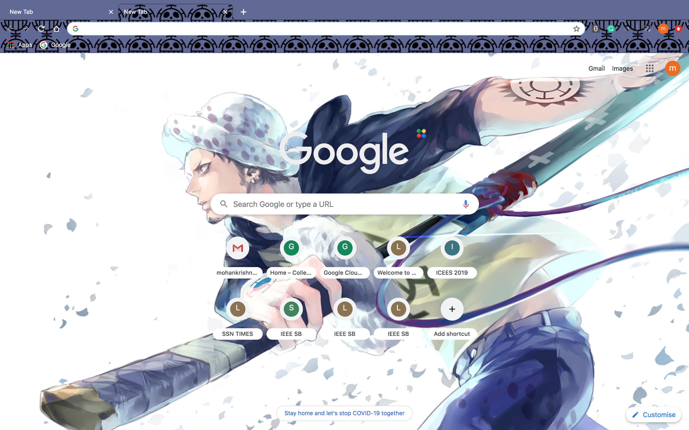

# LawTheme
Chrome theme based on Trafalgar Law from One Piece.

## Theme 

Theme in action

Image used

## [DOWNLOAD FROM CHROME WEB STORE](https://chrome.google.com/webstore/detail/trafalgar-law-onepiece-th/ncadmoccbmecijabbjkigedciefojdeh)

## OR LOAD LOCALLY

1. Download the zip.
2. Open chrome type the url `chrome://extensions`.
3. Switch on the Developer mode at top right of the browser.
4. Click load Unpacked at the now displayed menu.
5. Choose the unziped folder of the theme.
6. Voila theme is added.

### Color scheme:

 `#06896`
 `#fdfdfe`
 `#000000`
