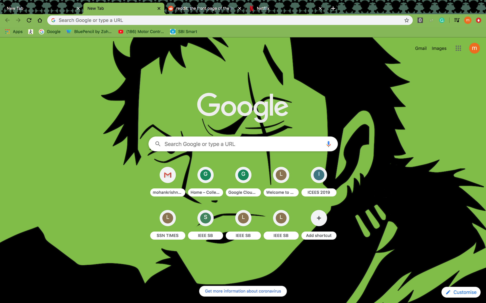
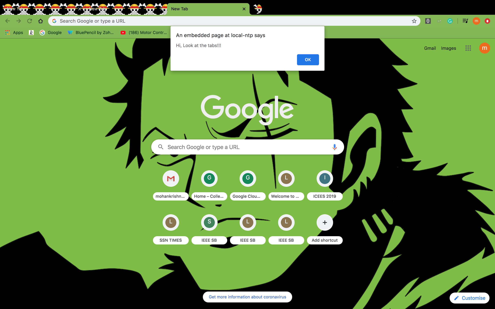

# ZoroTheme
Chrome theme based on Roronoa Zoro from One Piece

## Theme 

When Theme is active

When theme is inactive

## HOW TO USE

1. Download the zip.
2. Open chrome type the url `chrome://extensions`.
3. Switch on the Developer mode at top right of the browser.
4. Click load Unpacked at the now displayed menu.
5. Choose the unziped folder of the theme.
6. Voila theme is added.

### Color scheme:

 `#7bbc3e`
 `#000000`
